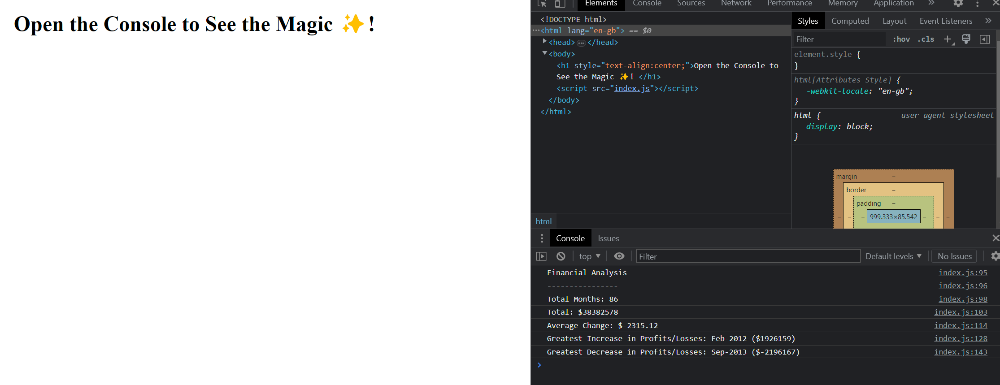
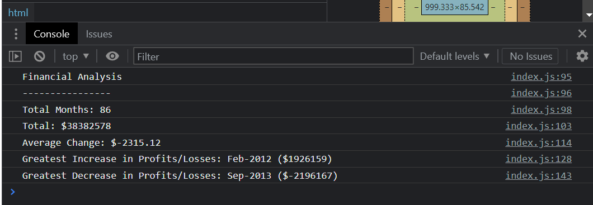

# Module-4-Challenge-Console-Finances

# Console Finances Challenge

## Description

I was tasked with creating a series of JavaScript codes which produced output to the Console. I was provided with an Array which represented the financial records of a Company.

The code had to analyse the records in the provided Array to calculate each of the following:

* The total number of months included in the dataset.

* The net total amount of Profit/Losses over the entire period.

* The average of the changes in Profit/Losses over the entire period.

* The greatest increase in Profit/Losses (date and amount) over the entire period.

* The greatest decrease in Profit/Losses (date and amount) over the entire period.

## Installation
Please visit this URL to see how the website looks now: https://halcyonlegion.github.io/Module-4-Challenge-Console-Finances/

## Usage

The Challenge is comprised of only 2 files - one HTML and the other JavaScript. The HTML links to the JavaScript and is only present to provide a simple message to the user to encourage them to open their Console to see what's going on.

The Console is accessed through the browser and contains the output of the JavaScript I wrote.

Closer look at the Console reveals the output.

## Credits

Roger Le the Instructor for this Bootcamp who has provided a lot of instruction and guidance on the journey so far. JavaScript is my biggest hurdle as I cannot easily work with complex Math functions in my head so I found this incredibly difficult.

The University of Birmingham provided the materials and guides I used to get this started: https://www.birmingham.ac.uk/index.aspx

To the incredible people who contribute to Stack Overflow: https://stackoverflow.com/

The creators of the MDN: https://developer.mozilla.org/en-US/

W3 Schools: https://www.w3schools.com/

License
There is no license specified for this project.